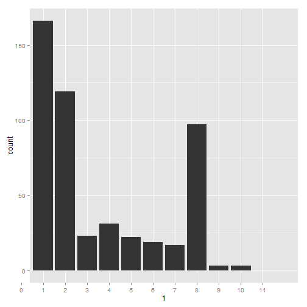

ELTA with Clustering
========================================================
author: Curtis Cochran  
date: Fri Oct 23 09:31:24 2015
autosize: true

Introducing ELTA with Clustering
========================================================

ELTA stands for External Lead Transformation Application. ELTA is ideal if you work in an environment where you have to constantly transform and cleanse data in preparation for use in other applications such as R or for import into other systems. You can use ELTA for the following tasks:

- Formatting Column Headers
- Removing Columns
- Editing Column Values
- Hierchical Clustering for Quick Segmentation (New Feature!)

Formatting and Removing Columns
========================================================


```r
summary(cars)
```

```
     speed           dist       
 Min.   : 4.0   Min.   :  2.00  
 1st Qu.:12.0   1st Qu.: 26.00  
 Median :15.0   Median : 36.00  
 Mean   :15.4   Mean   : 42.98  
 3rd Qu.:19.0   3rd Qu.: 56.00  
 Max.   :25.0   Max.   :120.00  
```

Slide With Plot
========================================================

 
